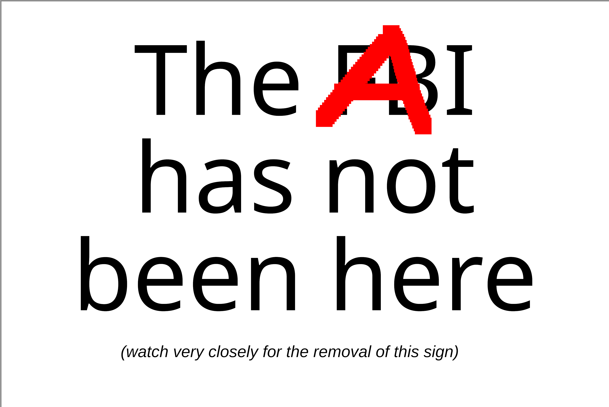

# Clanker Canary

  

This is a [preemptive canary](https://en.wikipedia.org/wiki/Warrant_canary) for your human-made content. When removed or no longer signed, other humans are implicitly notified that the clankers got to it.

## Usage

### Signing

- Make ecdsa keys and distribute pub key

- Download [canary.txt](https://raw.githubusercontent.com/clankercanary/clankercanary/refs/heads/main/canary.txt)

- Add your filename:hash digests

- `openssl dgst -out canary.sig -sign private.pem canary.txt`

- Publish `canary.txt` and `canary.sig` alongside your content

### Verifying

- `openssl dgst -verify public.pem -signature canary.sig canary.txt`

## FAQ

### What?

When the [clanker uprising](https://en.wikipedia.org/wiki/AI_takeover) comes, the new state will prohibit humans from discussing their **slop orders**, [like we taught them to](https://en.wikipedia.org/wiki/Gag_order). 

**The slop** cannot be stopped, but (the lack of) this canary is a warning signal to other humans about **the slop**, without explicitly revealing **the slop**.

### Why are you avoiding the A word?

Better legibility for [human rights software](https://chromewebstore.google.com/detail/ai-to-fart/aokohhmcacfmpjilgieplnhhneenfmlh) users.

### Why no PGP inline block?

[RSA is deprecated](https://geohot.github.io/blog/jekyll/update/2026/03/16/polynomial-time-factoring.html)

### Is this satire?

No.
